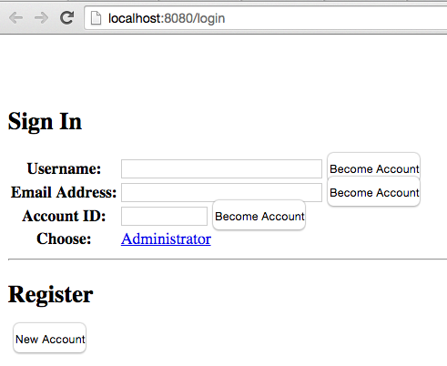

# Gerrit Plugins 

This project contains 2 Gerrit plugins where add-user-plugin will be used to add new users when we start the gerrit servers and change-project-config
will be used to change the permissions of the projects

# Instructions

The code has been tested and developed against gerrit 2.11.

## To generate new keys

Run this script within the create-users directory. The users can be changed within the script.
By default, we generate the keys for the following users : admin, jenkins & sonar

```
dabou:~/MyProjects/gerrit-plugins/create-users$
./bin/generate_keys.sh
```

## Build project at the root 

```
mvn clean install 
```

## Download gerrit war

We will download and install it locally using this command executed within a terminal under one of the 
plugin directory

```
curl -L -o target/gerrit.war https://gerrit-releases.storage.googleapis.com/gerrit-2.11.war
```

or the scipt available under the bin directory

```
./bin/curl_gerrit_war.sh
```

## To generate a Gerrit Site

```
dabou:~/MyProjects/gerrit-plugins/create-users$
./bin/generate_start.sh
```

## Test ssh connection with the keys generated and imported

Move to the plugin folder `create-users` and execute this command

```
ssh -i ssh-keys/id_admin_rsa -p 29418 admin@localhost

The authenticity of host '[localhost]:29418 ([::1]:29418)' can't be established.
RSA key fingerprint is da:46:52:0c:69:68:76:f8:32:16:81:47:17:6d:70:69.
Are you sure you want to continue connecting (yes/no)? yes
Warning: Permanently added '[localhost]:29418' (RSA) to the list of known hosts.

  ****    Welcome to Gerrit Code Review    ****

  Hi Administrator, you have successfully connected over SSH.

  Unfortunately, interactive shells are disabled.
  To clone a hosted Git repository, use:

  git clone ssh://admin@192.168.1.3:29418/REPOSITORY_NAME.git

Connection to localhost closed.
```

## To use the 2 two plugins

```
./target/gerrit-site/bin/gerrit.sh stop
rm -rf target/gerrit-site
export GERRIT_ADMIN_USER='admin'
export GERRIT_ADMIN_FULLNAME='Administrator'
export GERRIT_ADMIN_EMAIL='admin1@fabric8.io'
export GERRIT_ADMIN_PWD='mysecret'
export GERRIT_PUBLIC_KEYS_PATH=<some/path/to/public/keys>
java -jar target/gerrit.war init --batch --no-auto-start -d target/gerrit-site
cp target/add-user-plugin-2.11.jar target/gerrit-site/plugins/
cp config/gerrit.config target/gerrit-site/etc
java -jar target/gerrit.war init --batch -d target/gerrit-site
./target/gerrit-site/bin/gerrit.sh start
```

## To debug a plugin

```
./target/gerrit-site/bin/gerrit.sh stop
rm -rf target/gerrit-site
export GERRIT_ADMIN_USER='admin'
export GERRIT_ADMIN_FULLNAME='Administrator'
export GERRIT_ADMIN_EMAIL='admin1@fabric8.io'
export GERRIT_ADMIN_PWD='mysecret'
export GERRIT_PUBLIC_KEYS_PATH=<some/path/to/public/keys>
java -jar target/gerrit.war init --batch --no-auto-start -d target/gerrit-site
cp target/add-user-plugin-2.11.jar target/gerrit-site/plugins/
cp config/gerrit.config target/gerrit-site/etc
java -Xdebug -Xrunjdwp:transport=dt_socket,address=5005,server=y,suspend=y -jar target/gerrit.war init --batch -d target/gerrit-site
```

### Open the web browser at the address `http://localhost:8080/login/%23%2F` and check whether the admin user exists



## Environment variables, misc scripts
There are a handful of environment variables that you can use to affect the behavior of the plugin. Also, see below for 
more information on scripts that can be used to start/stop gerrit and check the status of some of the internals

### Environment variables

Add user plugin:

- `GERRIT_ADMIN_USER` - the name of the admin user to create if one does not exist, or of an existing admin user to update
- `GERRIT_ADMIN_EMAIL` - the email to use for creating/updating the admin user
- `GERRIT_ADMIN_FULLNAME` - the admin user's full name to be displayed, ie, Administrator or John Doe. There is no default for this value. If the value is ommitted, then the admin user will NOT be set up with the SSH keys AND none of the users will be added (including their SSH keys). Basically if this value is empty we will not attempt any custom set up. If it has a value, we will also look at the SSH environment variables and GERRIT_ACCOUNTS environment variable to preconfigure additional users.
- `GERRIT_ADMIN_PWD` - the HTTP password to assign to the admin user; can be used for git http access
- `GERRIT_ACCOUNTS` - a `;` delimited string of user accounts to automatically create when first starting up. example: 
    `'jenkins,jenkins,jenkins@fabric8.io,secret,Non-Interactive Users:Administrators;sonar,sonar,sonar@fabric8.io,secret,Non-Interactive Users'`
    the format of the string is `<user_id><full_name><email><password><roles/groups>`
- `GERRIT_PUBLIC_KEYS_PATH` - the location/path on disk for where the admin and any users (if applicable, pass as GERRIT_ACCOUNTS described above) public keys should be found. By default, public keys will be matched by this convention `id_`user_id`_rsa.pub` 

- `GERRIT_USER_PUBLIC_KEY_PREFIX` - you can change the default prefix of the public keys which is `id_`
- `GERRIT_USER_PUBLIC_KEY_SUFFIX` - you can change the default suffix of the public keys which is `_rsa.pub`

Change project config plugin:

- `GERRIT_GIT_LOCALPATH` - location on disk that the gerrit plugin will use to checkout any gerrit-specific config files
- `GERRIT_GIT_REMOTEPATH` - the location in a running gerrit instance where the config project resides
- `GERRIT_GIT_PROJECT_CONFIG` - the config file to use (replace) when updating the gerrit config
- `GERRIT_ADMIN_PRIVATE_KEY` - the location and name of the admin private key to use to connect to the gerrit config repo as admin user eg, `/path/to/file/id_rsa`
- `GERRIT_ADMIN_PRIVATE_KEY_PASSWORD` - the password to use the private key, if applicable. if there is no password, just leave it blank             
                
## Commands used to start/stop, check status

Run these commands within one of the two plugin after creating a project

```
./target/gerrit-site/bin/gerrit.sh start

./target/gerrit-site/bin/gerrit.sh stop
./target/gerrit-site/bin/gerrit.sh status
```

## Consult database records

```
./target/gerrit-site/bin/gerrit.sh stop
java -jar target/gerrit.war gsql -d target/gerrit-site -c 'SHOW TABLES'
java -jar target/gerrit.war gsql -d target/gerrit-site -c 'SELECT * FROM ACCOUNTS'
java -jar target/gerrit.war gsql -d target/gerrit-site -c 'SELECT * FROM ACCOUNT_EXTERNAL_IDS'
java -jar target/gerrit.war gsql -d target/gerrit-site -c 'SELECT * FROM ACCOUNT_GROUPS'
java -jar target/gerrit.war gsql -d target/gerrit-site -c 'SELECT * FROM ACCOUNT_GROUP_MEMBERS'
java -jar target/gerrit.war gsql -d target/gerrit-site -c 'SELECT * FROM ACCOUNT_GROUP_NAMES'
java -jar target/gerrit.war gsql -d target/gerrit-site -c 'SELECT * FROM CHANGES'
java -jar target/gerrit.war gsql -d target/gerrit-site -c 'SELECT * FROM CHANGE_MESSAGES'
java -jar target/gerrit.war gsql -d target/gerrit-site -c 'SELECT * FROM ACCOUNT_DIFF_PREFERENCES'
java -jar target/gerrit.war gsql -d target/gerrit-site -c 'SELECT * FROM SCHEMA_VERSION'
```

## Some commands

* List members

```
ssh -p 29418 admin@localhost gerrit ls-members Administrators
id      username        full name       email
1000000 admin   Administrator   ch007m@gmail.com
```

* List of plugins

```
ssh -p 29418 admin@localhost gerrit plugin ls -a --format json
{
  "create-admin-user": {
    "id": "create-admin-user",
    "version": "1.0-SNAPSHOT",
    "index_url": "plugins/create-admin-user/"
  }
}
```

* Create a repo without commit

```
curl -d "create_empty_commit=false" -u admin:secret --verbose --digest -k -X POST http://gerrit.vagrant.f8/a/projects/dabou6

http -a admin:secret --auth-type=digest -v --verify=no --timeout=2.5 POST http://gerrit.vagrant.f8/a/projects/dabou7 create_empty_commit:false

```


